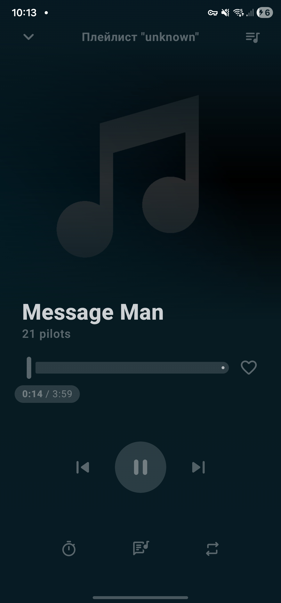
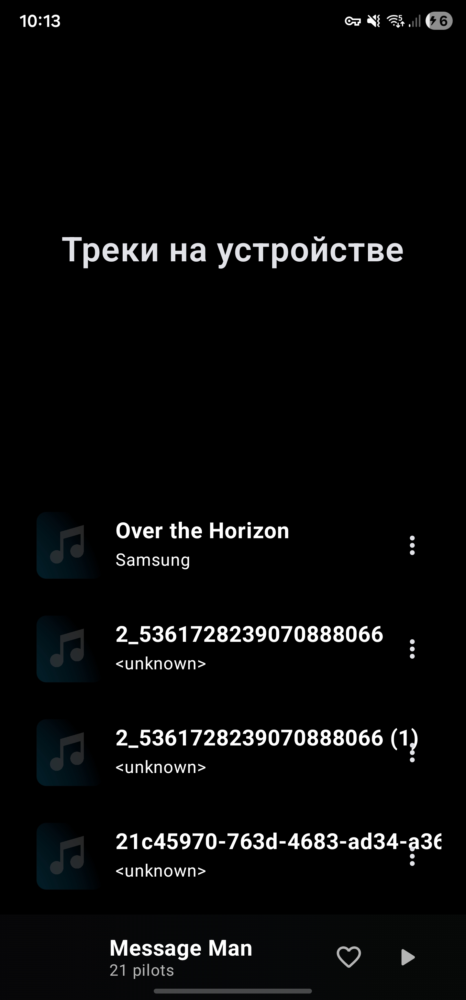

# InWave
Репозиторий команды "InWave" - проекта для дисциплины "Проектная деятельность" ЮФУ иММиКн им. И.И.Воровича 25' - 26'

Android-приложение стримингового сервиса для независимых исполнителей и аудиоконтента, свободного от авторских прав.

**InWave** делает акцент на социальное взаимодействие между слушателями и авторами через
комментарии с таймкодами, общие плейлисты и пользовательский контент.

---

## ✨ Возможности

- Воспроизведение аудио (локальное и облачное)
- Комментарии к трекам с таймкодами
- Профили пользователей с историей активности
- Общие плейлисты
- Социальная лента (лайки, комментарии, плейлисты)
- Загрузка пользовательских аудиофайлов в облако
- Упрощённые рекомендации (по жанрам и лайкам)

---

## 📸 Скриншоты

---

## Статус проекта

**В разработке**

**Текущий фокус (MVP / нулевая версия):**
- Воспроизведение локальных аудиофайлов
- Список треков из памяти устройства
- Базовый интерфейс плеера

---

## 🧱 Стек технологий
### Android

- Jetpack Compose
- Appyx Navigation
- Ktor Client
- Media3 (ExoPlayer)
- Dagger-Hilt
- Coil

### Backend

- Ktor Server
- Exposed ORM
- MinIO (S3-совместимое хранилище)
- Nginx
- Docker

---

## 🚀 Запуск проекта

### Требования

- Android Studio (последняя стабильная версия)
- Android SDK 28+ (>= Android 9)
- Gradle
